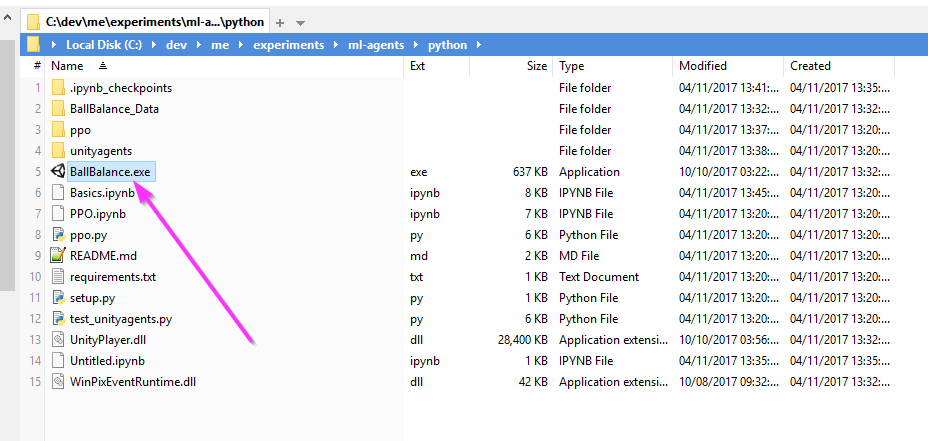
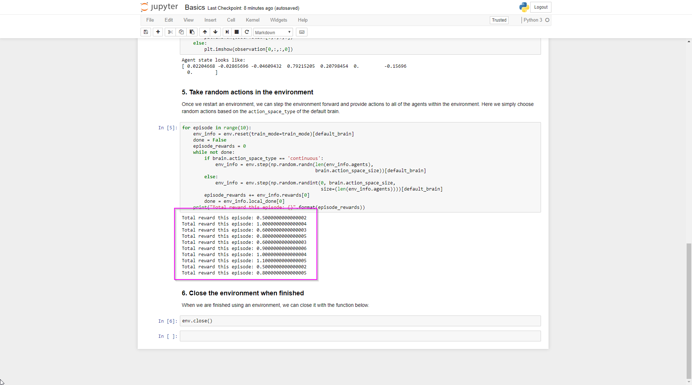
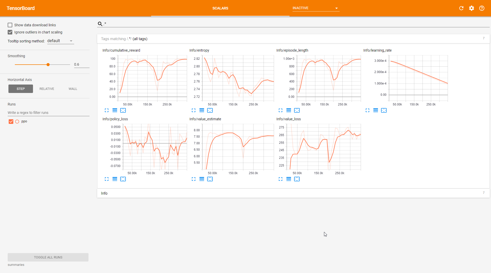
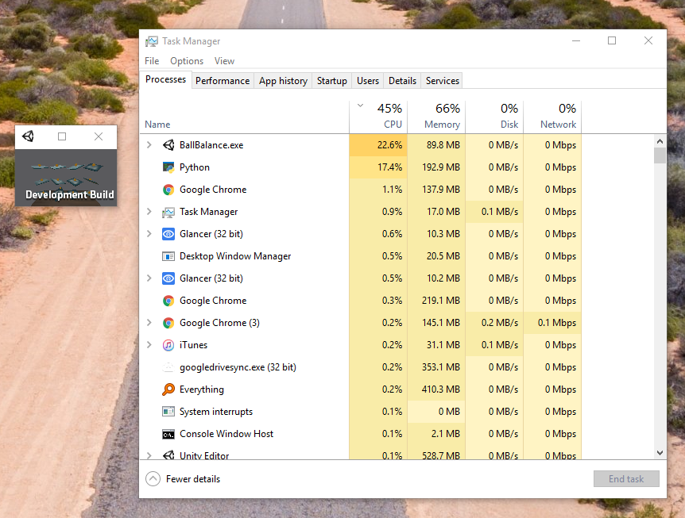
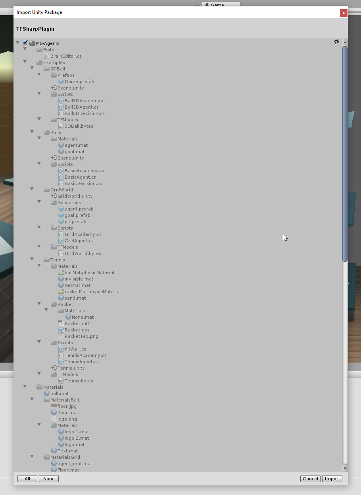

I mentioned [in my last post](/machine-learning/a-game-developer-learns-machine-learning-intent/) that the intent is to write an AI to play [Mr Nibbles Forever](http://epicshrimp.com/app/mrnibblesforever/) better an any human. Before we can get anywhere near that goal however we need to get the very basics working first.

<!-- more -->

# The Series

If you are new to the series I recommend you checkout the previous posts first, here's the whole series:

0. [A Game Developer Learns Machine Learning - Intent](/machine-learning/a-game-developer-learns-machine-learning-intent/)
1. A Game Developer Learns Machine Learning - Getting Started
1. [A Game Developer Learns Machine Learning - A Little Deeper](/machine-learning/a-game-developer-learns-machine-learning-a-little-deeper)
1. [A Game Developer Learns Machine Learning - Mr Nibbles Basics](/machine-learning/a-game-developer-learns-machine-learning-mr-nibbles-basics)

# TLDR;

We will use Reinforcement Learning to train an agent to balance a ball.



# Unity ML Agents

I find that when tacking something new for the first time, the best thing to do is take something built by others, then hack around with it for a little bit to understand the very basics. So rather than starting from total scratch im going to look for something that already exists.

As luck would have it, Unity have [just released](https://blogs.unity3d.com/2017/09/19/introducing-unity-machine-learning-agents/) a new set of tools to help game developers use machine learing in their games, perfect!

# Getting Setup

First things first, I clone the Unity ML Agents repo https://github.com/Unity-Technologies/ml-agents.

Then I start following their [Getting Started With Balance Ball](https://github.com/Unity-Technologies/ml-agents/blob/master/docs/Getting-Started-with-Balance-Ball.md) docs.

The first thing I need to do is get my system setup with the neccessary tools for machine learning. I follow this guide to do so: https://unity3d.college/2017/10/25/machine-learning-in-unity3d-setting-up-the-environment-tensorflow-for-agentml-on-windows-10/

This process takes quite a while, make sure you follow the instructions EXACTLY. At the bottom of that page is a video which is helpful.



# Jupyter Notebook

So with my system now setup I return back to the [Balance Ball](https://github.com/Unity-Technologies/ml-agents/blob/master/docs/Getting-Started-with-Balance-Ball.md) doc.

The next step is to open Jupyter Notebook which is a popular tool with ML community for training models.

[](./jupyter-basics.png)

Its actually a pretty aweomse tool. Its sort of like a [REPL](https://en.wikipedia.org/wiki/Read%E2%80%93eval%E2%80%93print_loop) mixed with word document.

You can write code right inside of the doc without firing up and IDE and then execute it and see the results inline.

# Testing the Bridge

Next up is the "Testing Python API" section of the docs.

In Unity the balance ball scene is compiled into an exe, this is whats known as the "environment".

[](./showing-exe.png)

Python in the notebook talks to the "brain" in the environment. Its a sort of native bridge between the machine learning API in Python and your "game" / "environment".

[](./bridge.png)

When the training session is started from python, the environment exe is executed which opens as a separate window on your computer. This surprised me as I was expecting it to be hidden background process of some sort.

The environment window that opens up is tiny, presumably so your GFX card doesn't have to waste cycles on rendering and can instead focus on ML.

[](./env-window.png)

The "brain" in the environment is able to receive commands which are called "actions". When an action runs, it changes the "state" of the environment which is returned back to Python. That process of `State > Action > New State` is repeated over and over again (along with some other magic) and out pops our agent.

[](./learn-loop.png)

# Training the Model

Now we know our bridge from Pythong to Unity works okay we can move onto actually training the model.

Folling the "Training with PPO" section of the docs we open "TensorBoard" which gives us stats on the the training process as it runs.

[](./tensorboard1.png)

Im not really sure what all those stats mean but thats okay at this stage, we are just tinkering!

The main thing is my model is busy training itself as evidenced by the changing graphs and my pegged CPU 😜

[](./pegged-cpu.png)

# Testing the Model

Once the "cumulative_reward" is above 75 the model is ready to rock. So I stop the training process in Jupyter.

Theres one last step before we can run the model in Unity, we must add support for TensorFlow directly in Unity in the form of the TensorFlowSharp library.

[](./tf-sharp.png)

TensorFlowSharp requires the experimental .Net 4.6 support in Unity. Thats something to note because as my goal is to eventually get this working on Mr Nibbles Forever which is built on the old .Net 3.5

With the library installed we copy over the generated model into the game and huzzah! It works!

[](./it-works.png)

# Adding some Dynamics

Its awesome that it works but its hard to tell if this is actually balancing the ball dynamically or not. I think if we add a dynamism it will make things clear.

Lets add this script to each of the platforms:

```csharp
using System.Collections;
using System.Collections.Generic;
using UnityEngine;

public class BallNudger : MonoBehaviour
{
    public Color nudgeColor = Color.red;
    public float forceMultiplier = 5f;
    public float colorChangeTime = 0.5f;

    private bool _isNudging = false;
    private Renderer _renderer;
    private Rigidbody _rigidBody;
    private Color _startingColor;
    private float _colorChangeAge;

    void Awake()
    {
        _renderer = GetComponent<Renderer>();
        _rigidBody = GetComponent<Rigidbody>();
        _startingColor = _renderer.material.color;
        _colorChangeAge = colorChangeTime;
    }

    void OnMouseDown()
    {
        _colorChangeAge = 0;
        var ray = Camera.main.ScreenPointToRay(Input.mousePosition);
        RaycastHit hit;
        if (Physics.Raycast(ray, out hit))
            _rigidBody.AddForceAtPosition(ray.direction * forceMultiplier,
                hit.point, ForceMode.Impulse);
    }

    void Update()
    {
        _colorChangeAge += Time.deltaTime;
        _renderer.material.color = _colorChangeAge < colorChangeTime ?
            nudgeColor : _startingColor;
    }

    private Vector3 GetRandomForce()
    {
        return new Vector3(
            Random.Range(-forceMultiplier, forceMultiplier),
            Random.Range(-forceMultiplier, forceMultiplier),
            Random.Range(-forceMultiplier, forceMultiplier));
    }
}
```

Now when we click the ball, it changes color and gets a little nudge. Lets run it again and yes, indeed the AI is able to balance the ball dynamically as the input changes.



# Conclusion

Cool! Well that wasn't as hard as I thought it was going to be.

Sure I haven't actually done any of the hard work or really learnt much about the fundamentals yet but at least I have something working, ready for me to hack with.

So stay tuned, subscribe below as next episode im going to dive a little deeper.
